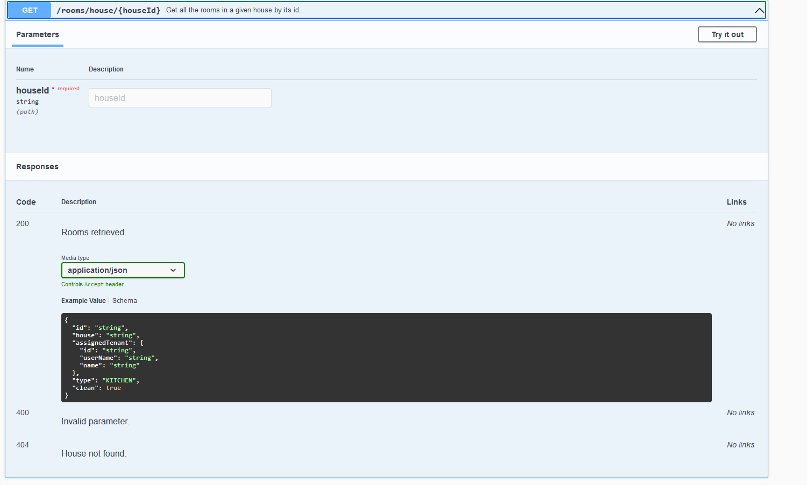

# Room Cleaner

RoomCleaner is a simple Web application built with SpringBoot/SpringData and MongoDB.
It's a backe-end engine which supports the storage, retrieval and update of data concerning Houses, Rooms and Tenants,
aiming at improving your day-to-day planning of cleaning activities around your house.

This project is still at a very early stage, but it offers some documented REST APIs (which may change in the future) that lay the foundations for RoomCleaner's core services.

For what's next, jump to the **TODO** section.

Technologies stack:
- Spring Boot
- Spring Data
- MongoDB

## REST APIs Documentation

The documentation for the REST APIs that are exposed in RoomCleaner is built upon **OpenAPI3.0** and **SwaggerUI**, and it can be found at the following address, when the project has been built and boot with SpringBoot's Maven plugin (**mvnw** command):

> http://localhost:8080/swagger-ui/index.html#/

The endpoints are grouped in three different sections, one for each object of the model:

Each endpoint has its own documentation with required/optional parameters, body and responses:

Schemas of the main objects of the model are also available in the Swagger UI interface:

## TODO

- Improve back-end logic, unit tests and endpoints;
- Add Auth with Spring Security: queries will then return only those objects that a User is actually entitled to interact with;
- Front-end layer.

